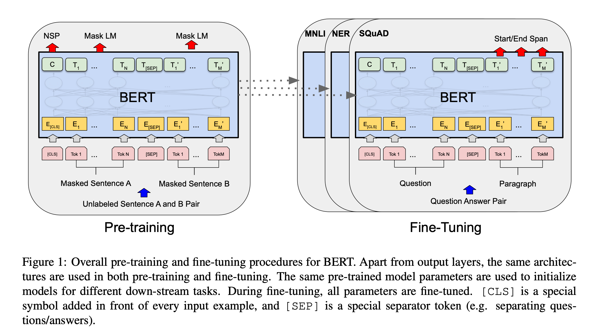

# BERTを用いたチャットボット

  

## はじめに

このチャットボットは、自然言語処理モデルであるBERTを用いて構築されています。BERTは、Transformerと呼ばれるニューラルネットワークアーキテクチャに基づいており、大量のテキストデータから学習することで、文脈理解や自然言語生成などの能力を獲得しています。

### 注意事項

outputディレクトリはgithubの容量の限界なので、
別途、自作する必要があります。
googleColabretoryでbert_qa.ipynbを実行してください。

## 機能

このチャットボットは以下の機能を備えています。

+ 質問応答: ユーザーの質問に対して、関連する情報を提供します。
+ 会話: ユーザーと自然な会話を行うことができます。

## BEATについて[^1]

  

### 自然言語処理(BERT)とは

BERTは、google検索やDeeplなどで使われています。とても、高精度で使用しやすい自然言語処理モデル。
従来の自然言語処理モデルとは異なり、双方向から文脈を理解できる点が特徴です。
BERTの学習では、事前学習とファインチューニングの二つに分かれます。事前学習で言語の基礎を学習し、ファインチューニングで、個別のタスクに合うように調整します。

### BERTの特徴
BERTには、以下の特徴があります。

+ 双方向性: 従来のモデルは、文頭から文末の方向でしか文脈を理解できませんでした。一方、BERTは双方向から文脈を理解できるため、より精度の高い処理が可能になっています。
+ 転移学習（ファインチューニング）: BERTは、大量のテキストデータで事前学習されています。そのため、特定のタスクに特化した学習を行うことなく、様々なタスクに適用することができます。
+ 汎用性: BERTは、翻訳、文書分類、質問応答など、様々な自然言語処理タスクに適用することができます。

### BERTの応用例

BERTは、様々な自然言語処理タスクに適用することができます。以下はその一例です。

+ 翻訳: BERTは、文脈を理解した上で翻訳を行うことができるため、より自然な翻訳結果を得ることができます。
+ 文書分類: BERTは、文書の内容を理解した上で分類を行うことができるため、より精度の高い分類結果を得ることができます。
+ 質問応答: BERTは、質問の意味を理解した上で、適切な回答を導き出すことができます。

## Qiita記事

技術詳細はQiitaに記載しています。

[自然言語処理(BERT)を用いたチャットボット](https://qiita.com/sugiyama404/items/7691d7ff6a5b8c24eddf)

[^1]: 'BERT: Pre-training of Deep Bidirectional Transformers for Language Understanding', Jacob Devlin Ming-Wei Chang Kenton Lee Kristina Toutanova, (2019), Google AI Language
